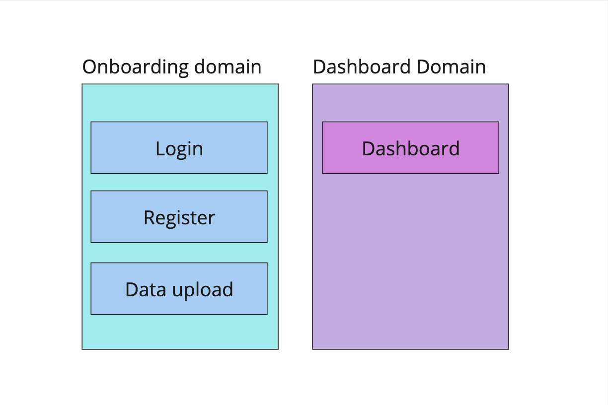
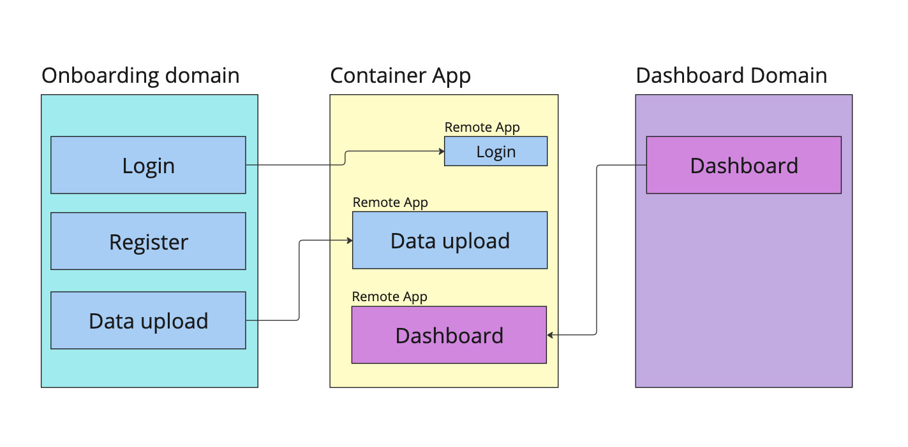
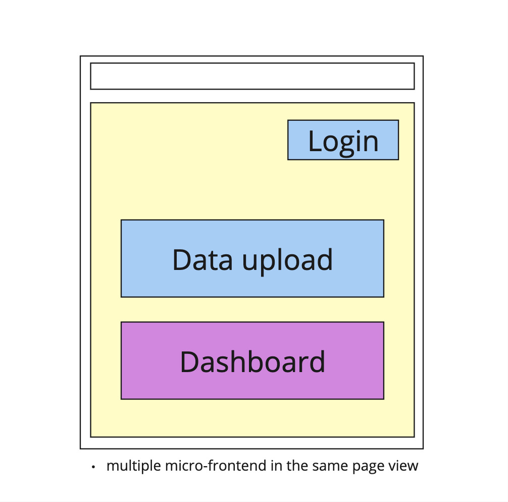

# Architecture Overview

Brief overview of micro-frontend architecture

## Micro-Frontend 

This project follows a Micro-Frontend Architecture using Next.js and Module Federation to split a single application into smaller, independently deployable micro-apps. These micro-apps are designed to be loaded dynamically into a single host or "container" application. This approach allows for greater scalability, flexibility, and autonomy for each individual micro-frontend while still delivering a seamless user experience.

### Domain based division

Dividing the frontend by domain using Domain-Driven Design (DDD) creates clear, modular boundaries between business functionalities like authentication, product catalog, or dashboard. Each domain is encapsulated within its own micro-frontend, allowing teams to work autonomously without tightly coupling their code to other areas of the application.

 This separation aligns the technical architecture with business needs, making it easier to manage, scale, and evolve different parts of the system independently. This way, teams reduce interdependencies, streamline development, and maintain a high level of cohesion within each domain, resulting in more maintainable and scalable codebases.

### Container App and Remote App

#### Container App (Host):
        The container is the main application that hosts the remote micro-frontends (often called remotes). It acts as a shell, responsible for loading and displaying remote components from the individual micro-frontends.
        The container is also responsible for managing shared dependencies, such as libraries or frameworks, that are used across the different micro-frontends.

#### Remote Apps:
        These are the individual micro-frontend applications that are developed, deployed, and managed independently. Each remote app "exposes" components or features that can be dynamically loaded and used by the container app.
        In this architecture, you have two remote apps that expose their functionality to the container app.

#### Module Federation:
        Module Federation is the Webpack plugin that enables micro-frontends to dynamically load and share modules across different applications. It allows the container app to load remote apps at runtime without bundling them together during the build process. This enables independent development and deployment for each micro-frontend.

###### Glossary of Terms

- Remote App:

        A micro-frontend application that is developed, deployed, and managed independently from other parts of the system. Remote apps expose certain components or modules to the host (container) application via Module Federation.

        Example: An onboarding app that handles the user onboarding flow might be a remote app that exposes a login form and other components to the container app.

- Container App (or Host App):

        The main application that acts as a shell and dynamically loads one or more remote micro-frontends. The container app is responsible for coordinating shared dependencies and rendering remote components within its interface.

        Example: The main app that hosts the onboarding app and a dashboard app, displaying their components as if they are part of a unified application.

- Expose:

        A term used in Module Federation that refers to the act of making specific components or modules of a remote app available to other apps (usually the container app). When a remote app exposes a module, the container can import and use it dynamically.

        Example: The onboarding app exposes a login component, which is then imported and rendered by the container app.

