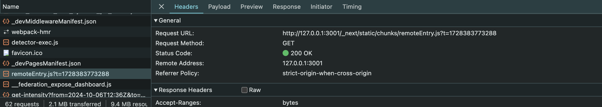

# Onboarding and mentoring

Welcome to the Team!

This document is designed to guide you through and help you integrate smoothly into our team and workflow. Whether you're new to the technologies we use or just our project, this guide will provide the resources and steps to get you up and running as quickly as possible.

### Table of Content

1. [Overview of the architecture](architecture-overview.md)
1. [Getting Started with Module Federation](#getting-started-with-module-federation)
1. [Getting started with monorepo](#getting-started-monorepo-with-turbo-and-nextjs)
1. [Get familiar with the Stack](#get-familiar-with-the-stack)
1. [Contributing](#contributing)
1. [Utils Links](#utils-links)


## Getting Started with Module Federation

In the context of Next.js and Module Federation, the integration can be primarily considered runtime micro-frontend integration.

It distinguishes between two main roles: `remote` and `container`:

  - Container: The primary application which consumes modules from remote applications.
  - Remote: Applications that expose specific modules to be consumed by the container.


With Module Federation, remote micro-frontends (or modules) are fetched dynamically at runtime, rather than at build time. This means that the container application (or host) does not need to have the entire code of the remote micro-frontends available at build time.

- The remote entry points (`remoteEntry.js`) are loaded at runtime, and the federated modules are pulled into the container application as needed. This allows for independent deployment of micro-frontends, meaning that one micro-frontend can be updated without requiring the container or other micro-frontends to be rebuilt or redeployed.

You can try in out live in the[ Module Federation website](https://webpack.js.org/concepts/module-federation/)

By configuring the remoteEntry.js file in your Webpack setup, you define which modules are available for sharing and how other applications can access them. This setup enables seamless integration and decoupled architecture where micro frontends are loosely bound yet can still collaborate effectively.

Check the [Module Federation guide](https://module-federation.io/guide/framework/nextjs) for more examples.

```bash
  webpack: (config) => {
    const moduleFederationConfig = {
      name: 'dashboard',
      filename: 'static/chunks/remoteEntry.js',
      remotes: {},
      extraOptions: {},
      exposes: {
       './dashboard': './src/mfe/dashboard.js',
      },
      shared: { react: { singleton: true }, 'react-dom': { singleton: true } },
    };
```

The container app will fetch the `remoteEntry.js` to each of the exposed remote application.




## Getting started Monorepo with Turbo and Next.js

A monorepo is a single repository that holds multiple projects, making it easier to manage shared code and maintain consistency across different applications. With Turborepo, we can optimize your monorepo workflows by efficiently handling builds, tasks, and dependencies, you can run tasks across multiple projects simultaneously, and it will intelligently run tasks in parallel, skipping tasks that don’t need to be re-run (due to caching).
Here’s a guide to understanding and using the turbo.json file and how package dependencies work in a monorepo setup.

### Understanding the turbo.json Configuration

The turbo.json file is where you define your build tasks, dependencies, and optimizations for your monorepo. Here’s how it works:
Basic Structure of turbo.json


```bash
{
  "$schema": "https://turbo.build/schema.json",
  "ui": "tui", //allows for viewing each log at once and interacting with the task
  "tasks": {
    "build": {
      "dependsOn": ["^build"], //A list of tasks that are required to complete before the task begins running.
      "inputs": ["$TURBO_DEFAULT$", ".env*"], // A list of file glob patterns relative to the package's package.json to consider when determining if a package has changed. turbo.json is always considered an input.
      "outputs": [".next/**", "!.next/cache/**"] //A list of file glob patterns relative to the package's package.json to cache when the task is successfully completed.
    },
    "lint": {
      "dependsOn": ["^lint"]
    },
    "dev": {
      "cache": false,
      "persistent": true
    }
  }
}
```

Case you want to add a new task script to Turbo to run in all the application inside the monorepo, you will need to add the script in the package.json and in the turbo.json. 
Por example to add the task to run tests `yarn test`, the follow the steps:
- add it in package.json the script:

```bash
"scripts": {
    "test": "turbo run test",
  }
```

- and add the task in the turbo.json:

```bash
"tasks":{
 "test": {
      "dependsOn": [
        "^build"
      ]
  }
}
```

For futher and details information, please, read the [turbo docs ](https://turbo.build/repo/docs/reference/configuration#ui)


## Get familiar with the Stack

- **typescript**

Typescript (or ts shortly) allows to write typesafe code.
TypeScript is a superset of JavaScript that adds static types to the language, allowing you to write type-safe code. This ensures that errors are caught at compile time, leading to more predictable and robust applications.


```bash
const a: number = 3;
```

-Getting Started: If you're new to TypeScript, I recommend watching this [10-minute video](https://www.youtube.com/watch?v=ahCwqrYpIuM) that provides a great introduction.

-Advanced Learning: Stay up to date by reviewing what's new in each version of TypeScript. Each release includes enhancements, and exploring the release notes can help you discover new ways to improve your code. Explore the [official TypeScript](https://www.typescriptlang.org/) docs.

- **Next.js**

Next.js is a React-based framework that provides both client-side and server-side rendering (SSR), static generation, and a variety of other powerful features like API routes and image optimization. It's a perfect fit for building scalable, high-performance applications with built-in routing and static site generation (SSG).

Key Features:
        -File-based routing system.
        -Automatic code splitting for faster page loads.
        -Optimized static and dynamic rendering, making it ideal for both SSR and SSG.
        -API routes for building backend endpoints directly in the frontend monorepo.

To learn more about Next.js and how to get started, refer to the official [Next.js documentation](https://nextjs.org/docs/getting-started/installation).

- **Jest and React Testing Library**

For unit and integration testing, we use Jest along with React Testing Library. This combination allows us to write robust, reliable tests that focus on component behavior and user interaction.

Jest: A JavaScript testing framework that works out of the box, making it easy to write tests for your components and logic.

React Testing Library: Encourages testing of your React components from the user's perspective, by querying and interacting with the rendered DOM rather than the implementation details.

Key Practices:
        - Write unit tests to test individual functions and components in isolation.
        - Use integration tests to verify that multiple components work together.
        - Aim for coverage of the most critical application paths to ensure robustness.

- Getting Started:

    For a basic introduction to Jest, check out the official Jest [documentation](https://jestjs.io/).
    To understand how to test React components, refer to the React Testing Library documentation.
    To understand [Next.js and Jest](https://nextjs.org/docs/app/building-your-application/testing/jest).


## Contributing

Ready to rock? 

See [Developer Guide](./developer-guide.md) to get started.


## Utils Links

For more information this guide explains how to use our tools:

- 🏎 [Turborepo](https://turbo.build/repo) — High-performance build system for Monorepos
- 🚀 [Next.js](https://nextjs.org/) — The React Framework for the Web

As well as a few others tools preconfigured:

- [TypeScript](https://www.typescriptlang.org/) for static type checking
- [ESLint](https://eslint.org/) for code linting
- [Prettier](https://prettier.io) for code formatting
- [GitHub Actions](https://github.com/changesets/action) for fully automated package publishing


